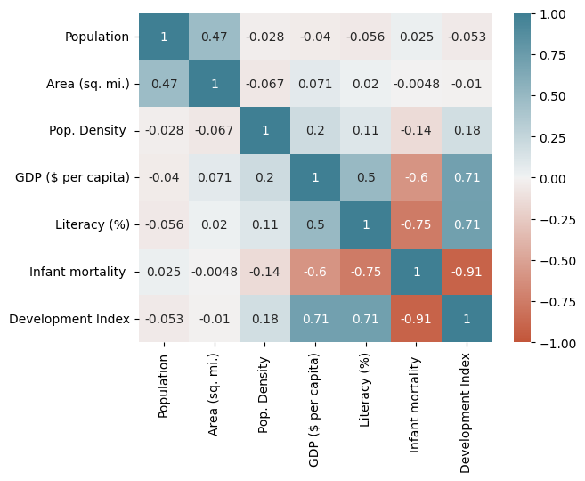

# mindsdb_xai
Tools and utilities for explainable AI.


## Data insights

### Example: correlation matrix

```python
import pandas as pd
from mindsdb_xai.data.corr import DataCorrelation

df = pd.read_csv('https://raw.githubusercontent.com/mindsdb/benchmarks/main/benchmarks/datasets/hdi/data.csv')

dc = DataCorrelation()  # creates an explainer
explanation = dc.explain(df)  # dictionary with all relevant insights
serialized = dc.export()
dc.visualize()  # plots the explanation
```

